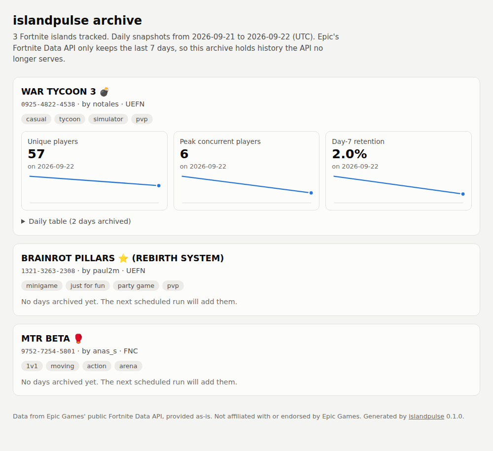

# islandpulse

**A zero-dependency Python client, CLI and daily archiver for Epic's public
[Fortnite Data API](https://dev.epicgames.com/documentation/en-us/fortnite/using-fortnite-data-api-in-fortnite).**

Epic publishes daily player metrics for every public, discoverable Fortnite
island (unique players, plays, peak concurrent players, minutes played,
favorites, recommendations, day-1 and day-7 retention), with no API key.
Epic doesn't ship an SDK, and the only existing client is an R package. islandpulse is:

- a **Python library** (standard library only, Python 3.10+) with typed
  results, cursor pagination, polite retries and clear errors;
- a **CLI** for quick lookups;
- an **archiver** plus a **GitHub Action** that snapshots your islands every day
  into CSV files committed to your repo, with a self-contained HTML report.



<sub>The screenshot shows the report built from the real API responses captured
in `tests/fixtures/`. Only one island has captured metrics (two days), so the
other two show as "no days archived yet".</sub>

## Why an archive?

The API only serves the **last 7 days**. A request for older data fails
with HTTP 400. Tomorrow, today's numbers from a week ago are gone for good.
The only way to get an island's history is to save it before it drops out of
the window. The included workflow does that once a day, so the repo slowly
becomes a dataset that nobody can recreate later.

## Quickstart

```sh
pipx install git+https://github.com/abafaboy/islandpulse
islandpulse metrics 0925-4822-4538
```

(Or use `pip install git+https://github.com/abafaboy/islandpulse`. It's not on PyPI yet.)

## Library

```python
from islandpulse import Client, last_complete_days

client = Client()  # no API key needed

island = client.island("0925-4822-4538")
print(island.title, island.creator_code, island.tags)

start, end = last_complete_days(6)  # the last 6 complete UTC days
for day in client.metrics("0925-4822-4538", start, end):
    print(day.date, day.unique_players, day.peak_ccu, day.retention_d7)

# The /islands firehose: newest islands first (NOT a ranking)
for isl in client.iter_islands(size=50, max_pages=2):
    print(isl.code, isl.title)
```

- `Client(base_url=..., timeout=30, max_retries=4, backoff=1.0, max_backoff=60, user_agent=..., opener=..., clock=...)`
  sends `User-Agent: islandpulse/<version> (+https://github.com/abafaboy/islandpulse)`.
  It retries HTTP 429, 5xx and network errors with exponential backoff (1 s,
  2 s, 4 s, ... capped at 60 s) and honours `Retry-After`. `opener` accepts
  any object with `open(request, timeout=...)`, which is how the tests run
  without a network.
- `metrics(code, start, end)` returns a list of `DailyMetrics` rows, one per
  timestamp, with the per-metric series merged together. Fields are
  `timestamp, unique_players, plays, minutes_played,
  average_minutes_per_player, peak_ccu, favorites, recommendations,
  retention_d1, retention_d7`. Any field can be `None`, because the API returns `null`.
  `start`/`end` accept aware or naive (UTC) datetimes, dates, or the exact API
  string form `2026-09-21T00:00:00.000Z`.
- These errors are raised **before** any request is sent, because the API would
  reject the request anyway: `InvalidIslandCode` (not `1234-5678-9012`),
  `LookbackError` (`start` older than 7 days) and `TimestampFormatError`
  (a string that is not full ISO 8601 with milliseconds and `Z`).
- HTTP errors raise `APIError` (with `.status`, `.url` and `.body`), or its
  subclasses `NotFoundError` and `RateLimitError`. `TransportError` means there
  was no HTTP answer. All of them derive from `IslandPulseError`.

## CLI

```text
islandpulse island CODE [--format table|json]
islandpulse metrics CODE [--days N] [--format table|csv|json] [--interval VALUE]
islandpulse new [--pages N] [--size N] [--format table|csv|json]
islandpulse archive --codes FILE --out DATA_DIR [--settle-days N]
islandpulse report --data DATA_DIR --out site/index.html
```

These global options go before the command: `--base-url URL`, `--timeout SECONDS` and `--version`.

> **About the example output below:** this sandbox can't reach the API. The
> output was produced by running the real CLI against the captured API
> responses in `tests/fixtures/`, served by the fake transport in
> `tests/fakes.py`, with the clock pinned to 2026-09-24 12:00 UTC. It is
> **not** live output.

```text
$ islandpulse island 0925-4822-4538
code:       0925-4822-4538
title:      WAR TYCOON 3 💣
creator:    notales
created in: UEFN
tags:       casual, tycoon, simulator, pvp

$ islandpulse metrics 0925-4822-4538
day         players  plays  peak  minutes  avg min  favs  recs    d1    d7
----------  -------  -----  ----  -------  -------  ----  ----  ----  ----
2026-09-21       88    116    16     3363    38.22     8     1  0.15  0.06
2026-09-22       57     71     6     1693     29.7     4     -  0.09  0.02

$ islandpulse metrics 0925-4822-4538 --days 3 --format csv
timestamp,unique_players,plays,minutes_played,average_minutes_per_player,peak_ccu,favorites,recommendations,retention_d1,retention_d7
2026-09-21T00:00:00.000Z,88,116,3363,38.22,16,8,1,0.15,0.06
2026-09-22T00:00:00.000Z,57,71,1693,29.7,6,4,,0.09,0.02

$ islandpulse new --pages 1 --size 2
code            made in  creator  title
--------------  -------  -------  -----------------------------------
1321-3263-2308  UEFN     paul2m   BRAINROT PILLARS ⭐ (REBIRTH SYSTEM)
9752-7254-5801  FNC      anas_s   MTR BETA 🥊

$ cat my-islands.txt
# my islands
0925-4822-4538

$ islandpulse archive --codes my-islands.txt --out data
0925-4822-4538: +2 rows, 0 cells filled

$ islandpulse archive --codes my-islands.txt --out data   # run again: nothing duplicated
0925-4822-4538: +0 rows, 0 cells filled

$ islandpulse report --data data --out site/index.html
wrote site/index.html
```

Details:

- `metrics --days N` covers the last N **complete** UTC days, where N is
  1 to 6 (default 6). The API window is 7 days back from *now*, so only 6 whole
  days fit inside it.
- `new` reads the `/islands` firehose, which lists islands newest first. It is
  not a popularity ranking. `--size` sets the islands per page (default 20).
- `archive` reads island codes from a text file (one per line, `#` starts a
  comment). For each code it fetches the island's metadata and its recent
  complete days. It then merges those days into `DATA_DIR/<code>.csv` and
  updates `DATA_DIR/islands.csv` (code, title, creator, tags). The merge rules:
  - A timestamp is never duplicated, and rows stay sorted.
  - A value that is already archived is **never rewritten**. The only change
    to an existing row is filling a cell that was empty (`null`) and now has
    a value.
  - `--settle-days N` (default 1) skips the newest N complete days, so a day
    is frozen only after Epic has had time to finish it. Each day stays in
    the fetch window for several runs, so a missed run loses nothing.
  - If some codes fail (for example, an island went private), the others are
    still archived. The command exits non-zero only when every code fails.
- `report` writes one HTML file with no external JS, CSS or fonts. It shows
  inline SVG sparklines for unique players, peak CCU and day-7 retention, a
  daily table for each island, light and dark themes via
  `prefers-color-scheme`, and a layout that works on phones.

## Fork this to archive your own islands in 2 minutes

1. **Fork** this repo.
2. Edit **`tracked.txt`**: replace the three example codes with your islands'
   codes, one per line.
3. **Delete** the `data/` and `site/` folders from your fork, if present,
   so your dataset starts clean.
4. **Settings → Actions → General**: allow Actions, then under
   *Workflow permissions* select **Read and write permissions**. The workflow
   commits `data/` and `site/` back to the repo.
5. **Actions tab**: forks have workflows disabled, so click *I understand my
   workflows, go ahead and enable them*. Then open **archive** and click
   **Run workflow** once to check that it works. After that it runs daily at
   02:15 UTC.
6. *(Optional)* **Publish the report**: go to **Settings → Pages → Source:
   GitHub Actions**, then go to **Settings → Secrets and variables → Actions →
   Variables** and add `ISLANDPULSE_PAGES` = `true`.

GitHub pauses scheduled workflows in public repos with no activity for
60 days. If that happens, re-enable the workflow from the Actions tab.

## Data notes and licence

- The data comes from Epic Games' public Fortnite Data API. It only covers
  public, discoverable islands. Epic's documentation says creators can't opt out.
- **islandpulse is not affiliated with or endorsed by Epic Games.** Fortnite
  is a trademark of Epic Games, Inc.
- Epic's documentation doesn't state an explicit licence for redistributing
  this data. If you publish an archive, **review Epic's terms first**. Any
  dataset in this repo is provided as-is, with no warranty of accuracy or
  completeness.
- The MIT licence in `LICENSE` covers **the code only**. It does not cover
  Epic's data.

## Limitations and what is (not) verified

- **No search or ranking endpoint.** You have to know the island codes you
  want. `/islands` is only a newest-first firehose.
- **7-day window.** Data older than 7 days is gone unless someone archived it.
- **Rate limits are undocumented.** Epic says "some rate-limiting" applies.
  islandpulse backs off on 429 and honours `Retry-After`, but the actual limits
  aren't known.
- Verified against real responses (see `tests/fixtures/`): the shapes of
  `/islands`, `/islands/{code}` and `/islands/{code}/metrics`, including
  `null` values; `from`/`to` must be full ISO 8601 with milliseconds and `Z`;
  a `from` older than 7 days returns 400; per-metric routes such as
  `/metrics/peak-ccu` don't exist; the `startDate`/`endDate`/`limit`/`orderBy`
  parameters that fortniteR sends are silently ignored.
- **Not verified:**
  - **The `interval` parameter.** Epic's docs mention ten-minute, hour and
    day buckets but don't name a parameter. `Client.metrics(..., interval=...)`
    and `--interval` pass it through as an `interval` query parameter. That is
    what fortniteR sends, but this hasn't been confirmed to work, and one
    third-party crawler uses a `/metrics/{day|hour|minute}` path instead.
    Leave it unset to get the default daily buckets.
  - **When `/islands` pagination ends.** islandpulse stops when a page has no
    `nextCursor` or no islands.
  - **The maximum `size`.**
  - **Whether Epic revises recent days after publishing them.** That is why
    `--settle-days` exists.

## Development

```sh
pip install -e . pytest
pytest
```

The tests make no network calls. `tests/fakes.py` serves the captured
responses through an injected opener.

## Roadmap (ideas, not commitments)

- Publish to PyPI.
- Future: a TypeScript client with the same archive format.
- Future: cross-reference with Roblox experience metrics.

## Licence

MIT (code only). See [LICENSE](LICENSE).
